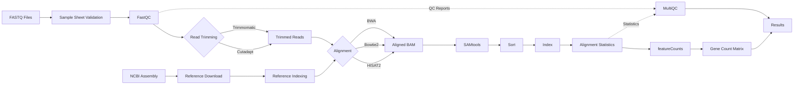

# RNAForge

> **A modular, reproducible, and scalable Nextflow DSL2 pipeline for
> RNA-seq analysis**


**RNAForge** provides a modular, reproducible, and containerized RNA-seq workflow for quality control, alignment, and gene quantification using Nextflow DSL2.

[](https://doi.org/10.5281/zenodo.21473005)


---

## Overview

RNAForge is an end-to-end RNA-seq analysis workflow built using **Nextflow DSL2**. It automates quality control, optional read trimming, reference genome retrieval and indexing, sequence alignment, post-alignment processing, and gene quantification. By combining a modular architecture with containerized execution, RNAForge enables reproducible, scalable, and portable transcriptomic analyses across local workstations, HPC clusters, and cloud environments.

## Contents

- [Overview](#overview)
- [Features](#features)
- [Workflow](#workflow)
- [Repository Structure](#repository-structure)
- [Requirements](#requirements)
- [Installation](#installation)
- [Quick Start](#quick-start)
- [Supported Inputs](#supported-inputs)
- [Generated Outputs](#generated-outputs)
- [Output](#output)
- [Results](#results)
- [Reproducibility](#reproducibility)
- [Docker](#docker)
- [HPC](#hpc)
- [Parameters](#parameters)
- [Citation](#citation)
- [Contributing](#contributing)
- [License](#license)
- [Contact](#contact)

## Features

### Quality Control

- FastQC
- MultiQC

### Read Processing

- Cutadapt
- Trimmomatic

### Alignment

- HISAT2
- Bowtie2
- BWA

### Post-processing

- SAMtools

### Quantification

- featureCounts

### Infrastructure

- Nextflow DSL2
- Docker
- Apptainer
- Resume support
- HPC ready
---

## Workflow



---

# Repository Structure

``` text
RNAForge/
├── lib/
├── modules/
│   ├── alignment/
│   ├── input/
│   ├── post_alignment/
│   ├── qc/
│   ├── quantification/
│   ├── reference/
│   └── trimming/
├── scripts/
├── subworkflows/
├── main.nf
├── nextflow.config
├── README.md
├── LICENSE
└── .gitignore
```

---

## Requirements

- Linux
- Java 17+
- Nextflow ≥ 25.x
- Docker ≥ 24 (recommended)
- Apptainer (optional)

---

## Installation

``` bash
git clone https://github.com/MohamedElsisii/RNAForge.git
cd RNAForge
```

Install Nextflow:

``` bash
curl -s https://get.nextflow.io | bash
sudo mv nextflow /usr/local/bin/
```

---

## Quick Start

> The examples below assume that the required reference genome will be downloaded automatically using the provided NCBI assembly accession.

# Single-End Data

```bash
nextflow run main.nf \
    --assembly GCF_000005845.2 \
    --input test_se \
    --aligner hisat2
```

---

# Paired-End Data

```bash
nextflow run main.nf \
    --assembly GCF_000005845.2 \
    --input test_pe \
    --aligner hisat2
```

---

# Run with Docker

```bash
nextflow run main.nf \
    -profile docker \
    --assembly GCF_000005845.2 \
    --input test_se
```

---

# Run with Bowtie2

```bash
nextflow run main.nf \
    --assembly GCF_000005845.2 \
    --input test_se \
    --aligner bowtie2
```

---

# Run with BWA

```bash
nextflow run main.nf \
    --assembly GCF_000005845.2 \
    --input test_se \
    --aligner bwa
```

---

# Resume a Previous Run

```bash
nextflow run main.nf \
    -profile docker \
    --assembly GCF_000005845.2 \
    --input test_se \
    -resume
```
---

## Supported Inputs

- Single-end FASTQ(.gz)
- Paired-end FASTQ(.gz)
- Sample sheet (CSV)
- NCBI Assembly accession
  
---
## Generated Outputs

- FastQC reports
- MultiQC report
- Trimmed FASTQ files
- BAM files
- BAM index (.bai)
- Alignment statistics
- Gene count matrix

---
## Output

RNAForge organizes all generated files into a structured output directory.

| Directory | Description |
|-----------|-------------|
| `results/fastqc/` | FastQC quality control reports |
| `results/multiqc/` | Aggregated MultiQC report |
| `results/trimmed/` | Trimmed FASTQ files |
| `results/reference/` | Downloaded reference genomes and indices |
| `results/alignment/` | Aligned BAM files |
| `results/samtools/` | Sorting, indexing and alignment statistics |
| `results/featurecounts/` | Gene count matrices |
| `results/logs/` | Nextflow execution logs (optional) |

Example:

```text
results/
├── fastqc/
├── multiqc/
├── trimmed/
├── reference/
├── alignment/
├── samtools/
├── featurecounts/
└── logs/
```

---

## Results

RNAForge generates:

- Quality-control reports (FastQC and MultiQC)
- Trimmed FASTQ files (optional)
- Sorted and indexed BAM files
- Alignment statistics
- Gene-level count matrices
- Execution logs for reproducibility

---

# Reproducibility

RNAForge uses:

-   Nextflow DSL2
-   Container support
-   Version-controlled workflow
-   Deterministic execution
-   Resume functionality

---

# Docker

``` bash
nextflow run main.nf -profile docker
```

---

# HPC

Example:

``` bash
nextflow run main.nf -profile slurm
```

---

# Parameters

| Parameter | Required | Description | Default |
|-----------|:--------:|-------------|---------|
| `--input` | ✅ | Input sample sheet or bundled test dataset | — |
| `--assembly` | ✅ | NCBI genome assembly accession | — |
| `--aligner` | No | Alignment software (`hisat2`, `bowtie2`, `bwa`) | `hisat2` |
| `--trimmer` | No | Trimming software (`cutadapt`, `trimmomatic`) | `cutadapt` |
| `--outdir` | No | Output directory | `results/` |
| `-profile docker` | No | Execute using Docker containers | Disabled |
| `-profile apptainer` | No | Execute using Apptainer containers | Disabled |
| `-resume` | No | Resume a previous workflow execution | Disabled |

---

## Citation

If you use **RNAForge** in your research, please cite the archived software release:

```bibtex
@software{elsisi2026rnaforge,
  author       = {Mohamed Elsisi},
  title        = {RNAForge},
  year         = {2026},
  version      = {1.0.0},
  publisher    = {Zenodo},
  doi          = {10.5281/zenodo.21473005},
  url          = {https://doi.org/10.5281/zenodo.21473005}
}
```

**DOI:** https://doi.org/10.5281/zenodo.21473005

For additional citation metadata, see `CITATION.cff`.

---

# Contributing

Contributions are welcome.

1.  Fork
2.  Create feature branch
3.  Commit
4.  Pull request


---

# License

Released under the MIT License.

---

# Contact

**Mohamed Elsisi**

GitHub: [MohamedElsisii](https://github.com/MohamedElsisii)
LinkedIn: [Mohamed Elsisi](https://www.linkedin.com/in/mohamed-elsisii/)
---

## Tested With

| Software | Version |
|----------|---------|
| Nextflow | 25.x |
| Java | 17 |
| Docker | 28 |
| Ubuntu | 24.04 LTS |

---

## Acknowledgements

RNAForge builds upon the excellent ecosystems surrounding Nextflow,
Docker, SAMtools, FastQC, featureCounts, HISAT2, BWA, Bowtie2 and the
broader open-source bioinformatics community.
